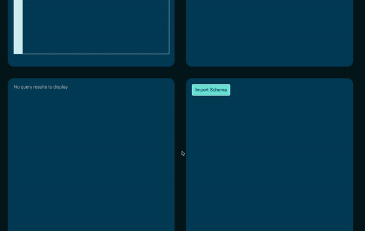
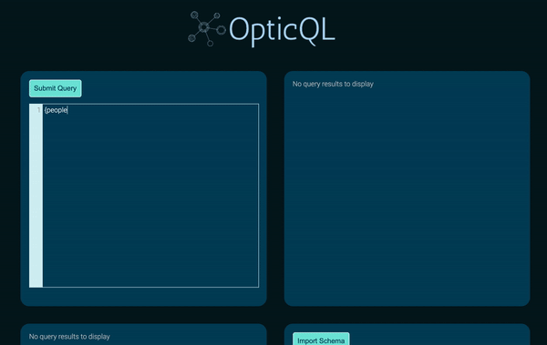
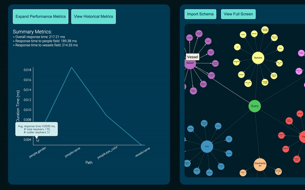
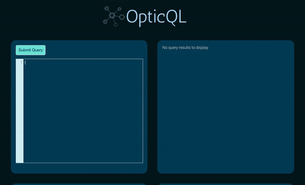

<!-- PROJECT SHIELDS -->
<!--
*** I'm using markdown "reference style" links for readability.
*** Reference links are enclosed in brackets [ ] instead of parentheses ( ).
*** See the bottom of this document for the declaration of the reference variables
*** for contributors-url, forks-url, etc. This is an optional, concise syntax you may use.
*** https://www.markdownguide.org/basic-syntax/#reference-style-links
-->
<!-- PROJECT LOGO -->
<br />
<p align="center">
  <a href="https://github.com/oslabs-beta/OpticQL/">
    
  </a>

## OpticQL
An Electron-based desktop application to assist in performance monitoring and interdepency visualization of a GraphQL Schema.

__________


<!-- TABLE OF CONTENTS -->
## Table of Contents

* [Download Instructions](#download-instructions)
* [About the Project](#about-the-project)
* [Usage](#usage)
  * [Additional Usage Notes](#additional-usage-notes)
* [Getting Started is Easy](#getting-started-is-easy)
  * [Important Setup Notes](#important-setup-notes)
  * [A Note About our Repo](#a-note-about-our-repo)
  * [Contributing to OpticQL](#contributing-to-opticql)
* [Contact Us](#contact-us)
* [The Production Team](#the-production-team)
* [License](#license)

<!-- Download Instructions -->
## Download Instructions

# OpticQL Electron App Install: 
1. Clone repo onto your local machine
2. Navigate to 'production' directory and run 'npm i' to download dependencies
3. 'npm run build' to create a production build
4. 'npm run dist' to build Electron app
5. Go to 'production' -> 'dist' -> 'mac'. The OpticQL app will be in this directory 
6. Follow rest of instructions at [Getting Started is Easy](#getting-started-is-easy)

<!-- ABOUT THE PROJECT -->
## About The Project

OpticQL is a developer tool designed to facilitate robust performance testing of GraphQL Schema at the field-level. Inteligence provided by OpticQL allows developers to optimize the design of GraphQL Schema and adjust both client-side and server-side code accordingly.

Import your applications' existing GraphQL Schema to the OpticQL desktop application and immediately see a dynamic visualization of the data graph's shape and interdepency. Next, submit either a query or mutation request from OpticQL to your application, with OpticQL automatically capturing performance trace metrics and the data returned by the request. Fields used in that current request (query or mutation) are highlighted inside the data graph visualization for immediate insight. Summary- and field-level performance information for both the current request, and saved requests, are displayed within robust charting.

<!-- USAGE EXAMPLES -->
## Usage

_______


**Feature One: Color-coded Schema Visualization** 

* Import in your schema to render a graphical representation of all fields, edges, and nodes. All type names are connected to their fields in a color-coded and dynamic view
* Input a query or mutation, all endpoints of the schema that have been "hit" by the request will turn green

<p align="center">
  
</p>

_______


**Feature Two: GraphQL Playground**

* Submit a query or mutation for response data and performance metrics of all requested fields
* Metrics include overall tracing data and individual resolver's path durations

<p align="center">
  
</p>

________


**Feature Three: Performance Metrics Tool**

* All query inputs will generate a graphical overview of the resolver paths' average response time via a line or bar chart
* Additional individual field-level performance metrics are available via a pop-up window

<p align="center">
  
</p>

_______

**Feature Four: Historical Comparison**

* Summary- and field-level performance information for both the current request, and past requests, are displayed within robust charting

<p align="center">
  
</p>

_______


### Additional Usage Notes

* OpticQL includes functionality to **view and store historical GraphQL response data within IndexedDB**, which can be **viewed inside of the Electron app's dev tools (console)**. In order to open dev tools inside Electron, please press Command + Option + I (Mac users) or Control + Shift + I (Windows users)
* At this time, **only GraphQL queries and mutations are supported**. Fragments are not currenty supported
* After a current GraphQL request has been made, you can click on the **Expand Performance Metrics** button to view **field-level resolver performance data**; however, please note that **you need to click the Expand Performance Metrics button again to close the pop-up window** (i.e., do not click the red 'x' button in the pop-up frame, or else the Electron app will need to be restarted (or refreshed) to work) 

<!-- GETTING STARTED -->
## Getting Started is Easy

We designed our application in Electron to give developers a fast forward way to download and use OpticQL. To get a local copy up and running, please follow these steps.

1. If you haven't downloaded the OpticQL Electron app, go back to [Download Instructions](#download-instructions)

2. OpticQL is designed for use alongside our companion (light-weight) NPM package, which will need to be installed on your application's server-side code (e.g., server.js). Please ensure that you follow and read all of the key instructions found directly on the npm website (link found below). 
```sh
npm install optic-ql
```

Website: [https://www.npmjs.com/package/optic-ql](https://www.npmjs.com/package/optic-ql/)

3. Finally, spin up the server on your application and start the OpticQL Electron app to begin analyzing performance data associated with your GraphQL requests!

### Important Setup Notes

* Express - You must be running an Express (NodeJS) server for the NPM package to work
* Apollo - OpticQL is designed to work alongside an Apollo Server, which is a community-maintained open-source GraphQL server

### A Note About our Repo

* Example Server-side Code - **Within the npmUser sub-folder, and for illustrative purposes, we have included a sample server.js file to show how our NPM package is integrated into an existing codebase**. The sample server.js file has a GraphQL schema (typeDefs and resolvers) based on The Star Wars API (SWAPI). If you have a PostgreSQL database URI populated with information from SWAPI, feel free to insert the URI into the models sub-folder (within npmUser) and try out OpticQL!

<!-- CONTRIBUTING -->
### Contributing to OpticQL

We greatly welcome any contributions to this application from the open source community! **See directions below**.

1. Fork the Project
2. Create your Feature Branch (`git checkout -b feature/NewFeature`)
3. Commit your Changes (`git commit -m 'Add some NewFeature'`)
4. Push to the Branch on your Fork (`git push origin feature/NewFeature`)
5. Open a Pull Request from the Branch on your Fork to the master branch on the OpticQL Master Branch


<!-- CONTACT -->
## Contact Us

Website: [http://www.opticql.com](http://www.opticql.com/)

Github Link: [https://github.com/oslabs-beta/OpticQL](https://github.com/oslabs-beta/OpticQL/)

<!--- Authors --->
## The Production Team

* Patrick Mullen [@GitHub](https://github.com/patrick934) [@LinkedIn](https://www.linkedin.com/in/patrick-mullen-834a4255/)
* Rebecca Miller [@GitHub](https://github.com/millerreb) [@LinkedIn](https://www.linkedin.com/in/rebecca-miller-18466552/)
* Nicole Du [@GitHub](https://github.com/Nikkkidew) [@LinkedIn](https://www.linkedin.com/in/nicole-du-05299472/)
* Bon-Jay Tseng [@GitHub](https://github.com/bj-tseng) [@LinkedIn](https://www.linkedin.com/in/bon-jay-tseng/)

<!-- LICENSE -->
## License

Distributed under the MIT License. See `LICENSE` for more information.
